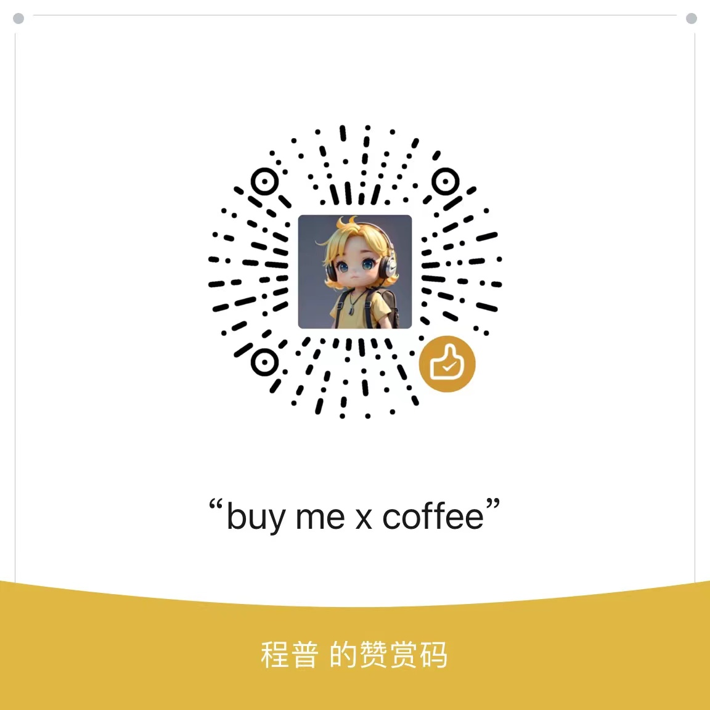

🌍 *[English](README.md) ∙ [简体中文](README-zh.md)*

# [J Blog](https://weijunext.com/)

**Blog Address**：https://weijunext.com  
**Blog Name**：J Blog  
**Main Content**: Summaries of experiences and technical sharing on Next.js/React

## About Me

**Full-Stack Engineer, Open-Source Next.js Artist & AI Enthusiast.**

**全栈工程师，Next.js 开源手艺人，AI降临派。**

[My Blog](https://weijunext.com)  
[Github](https://github.com/weijunext)  
[Twitter/X](https://twitter.com/weijunext)  
[Twitter/X - En](https://twitter.com/wayne_dev)  
[Medium](https://medium.com/@weijunext)  
[掘金](https://juejin.cn/user/26044008768029)  
[知乎](https://www.zhihu.com/people/mo-mo-mo-89-12-11)  
[微信交流群](https://weijunext.com/make-a-friend)  

If this project is helpful to you, star the repo and buy be a coffee, thank you.

